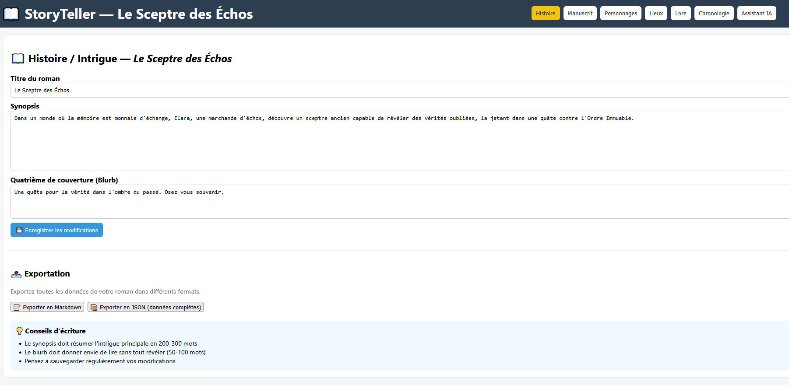
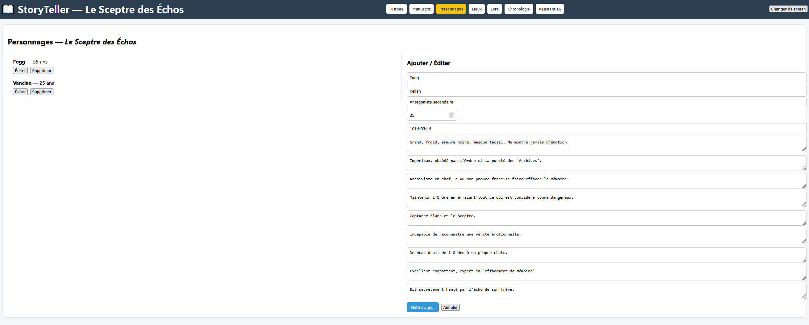

# **StoryTeller - Installation and User Guide**

StoryTeller is a comprehensive novel writing and management tool with AI-powered assistance for writing, character extraction, and consistency checking.

## **Quick Start with Docker (Recommended)**

### **Prerequisites**
* Docker Desktop installed ([Download here](https://www.docker.com/products/docker-desktop))
* Git (optional, for cloning the repository)

### **Installation**

1. **Clone or download the project**
   ```bash
   git clone <repository-url>
   cd storyteller
   ```

2. **Configure LLM (Optional but recommended)**

   Create a `.env` file in the `backend/` folder:
   ```env
   # Choose your LLM provider
   LLM_PROVIDER=anthropic
   ANTHROPIC_API_KEY=sk-ant-api03-xxxxxxxxxxxxx
   
   # Or use OpenAI
   # LLM_PROVIDER=openai
   # OPENAI_API_KEY=sk-xxxxxxxxxxxxx
   
   # Or use Ollama (local, free)
   # LLM_PROVIDER=ollama
   # OLLAMA_URL=http://localhost:11434
   ```

   > 📖 See [LLM Configuration Guide](#-ai-writing-assistant-setup) below for detailed setup instructions.

3. **Start the application**
   ```bash
   docker-compose up -d
   ```

4. **Access the application**
   * Frontend: [http://localhost:8080](http://localhost:8080)
   * Backend API: [http://localhost:8000/docs](http://localhost:8000/docs)

5. **Stop the application**
   ```bash
   docker-compose down
   ```

### **Docker Commands**

```bash
# Start services
docker-compose up -d

# View logs
docker-compose logs -f

# Restart services
docker-compose restart

# Stop and remove containers
docker-compose down

# Rebuild after code changes
docker-compose up -d --build
```

---

## **Local Development Setup**

For active development with hot-reload and debugging.

### **Prerequisites**
* Python 3.10 or 3.11 (spaCy broken in 3.12+)
* Node.js 18+ and npm

### **Backend Setup**

1. **Create and activate virtual environment**
   ```bash
   python -m venv .venv
   
   # Windows
   .venv\Scripts\Activate.ps1
   
   # Linux/Mac
   source .venv/bin/activate
   ```

2. **Install dependencies**
   ```bash
   cd backend
   pip install -r requirements.txt
   ```

3. **Install French spaCy model** (required for AI features)
   ```bash
   python -m spacy download fr_core_news_md
   ```

4. **Configure environment**

   Create `backend/.env`:
   ```env
   LLM_PROVIDER=anthropic
   ANTHROPIC_API_KEY=your-api-key-here
   ```

5. **Start the backend**
   ```bash
   python run.py
   ```

   Backend available at [http://127.0.0.1:8000](http://127.0.0.1:8000)

### **Frontend Setup**

1. **Install dependencies**
   ```bash
   cd frontend
   npm install
   ```

2. **Start development server**
   ```bash
   npm run dev
   ```

3. **Access the application**

   Open [http://localhost:5173](http://localhost:5173) in your browser

---

## **🤖 AI Writing Assistant Setup**

StoryTeller includes powerful AI features for writing assistance and content extraction. Choose your preferred LLM provider:

### **Supported Providers**

| Provider | Cost | Quality | Speed | Privacy |
|----------|------|---------|-------|---------|
| **Anthropic Claude** ⭐ | ~$3-8/1M tokens | Excellent | Fast | Cloud |
| **OpenAI GPT-4** | ~$10-30/1M tokens | Excellent | Fast | Cloud |
| **Ollama** 🆓 | Free | Good | Slow (without GPU) | Local |

### **1. Anthropic Claude (Recommended)**

Best for creative writing with excellent context understanding.

**Setup:**
```bash
pip install anthropic
```

**Configuration (`.env`):**
```env
LLM_PROVIDER=anthropic
ANTHROPIC_API_KEY=sk-ant-api03-xxxxxxxxxxxxx
```

**Get API Key:**
1. Visit [console.anthropic.com](https://console.anthropic.com/)
2. Create account
3. Navigate to "API Keys"
4. Create new key
5. Copy to `.env`

### **2. OpenAI GPT-4**

**Setup:**
```bash
pip install openai
```

**Configuration (`.env`):**
```env
LLM_PROVIDER=openai
OPENAI_API_KEY=sk-xxxxxxxxxxxxx
```

**Get API Key:**
1. Visit [platform.openai.com](https://platform.openai.com/)
2. Create account and add payment method
3. Create API key
4. Copy to `.env`

### **3. Ollama (Free & Local)**

Run AI models locally without cost or usage limits.

**Setup:**
```bash
# Download from https://ollama.com/download
# Or on Linux/Mac:
curl -fsSL https://ollama.com/install.sh | sh

# Download a model
ollama pull mistral      # 7B - Fast and good
ollama pull mixtral      # 8x7B - More powerful
```

**Configuration (`.env`):**
```env
LLM_PROVIDER=ollama
OLLAMA_URL=http://localhost:11434
```

**Requirements:**
* 8-16 GB RAM
* GPU recommended for speed
* 4-7 GB disk space per model

### **Verify Configuration**

Test your LLM setup:
```bash
curl http://localhost:8000/api/llm/health
```

Expected response:
```json
{
  "provider": "anthropic",
  "configured": true
}
```

---

## **Features Overview**

### **Core Features**

* **Story Management**: Title, synopsis, back cover
* **Manuscript Editor**: Enhanced Markdown editor with auto-save
* **Character Profiles**: Detailed character sheets
* **Locations Database**: Key places in your story
* **Lore Encyclopedia**: Factions, magic systems, objects
* **Timeline**: Chronological event tracking
* **Export**: Markdown and PDF export

### **🤖 AI-Powered Features**

#### **1. Writing Assistant**

Generate and enhance your story content with AI.

**Capabilities:**
* ✍️ **Generate Complete Chapters**: From summaries and style preferences
* ➡️ **Continue Writing**: Extend existing manuscripts
* 🔄 **Rewrite & Improve**: Enhance existing text
* 💡 **Scene Suggestions**: Get ideas for next scenes

**Usage:**
1. Navigate to "✍️ Writing Assistant" tab
2. Select mode (Generate/Continue/Rewrite/Suggest)
3. Provide context and preferences
4. Click generate and wait 20-60 seconds
5. Review and save results

**Generation Options:**
* **Style**: Narrative, dialogue, descriptive, action
* **Length**: Short (500-800 words), Medium (1000-1500), Long (2000-3000)
* **Tone**: Neutral, dramatic, humorous, dark, light
* **POV**: First person, third person, etc.

#### **2. Smart Extraction**

Automatically extract story elements from your manuscripts.

**Extract:**
* 👤 **Characters**: Names, roles, descriptions, personalities
* 📍 **Locations**: Places, types, descriptions
* 📅 **Timeline Events**: Dates and occurrences
* 📚 **Lore Entries**: World-building elements

**Usage:**
1. Navigate to "🔍 Extraction" tab
2. Select a manuscript
3. Choose extraction types
4. Review extracted elements
5. Import desired items to your database

**Benefits:**
* Save hours of manual data entry
* Maintain consistency across chapters
* Discover overlooked story elements
* Build comprehensive story databases quickly

#### **3. AI Consistency Checker**

Identify inconsistencies in your story.

**Features:**
* Find character relationships
* Detect timeline inconsistencies
* Verify age calculations
* Check birth dates vs. events

---

## **User Guide**

### **Navigation**

Use the navigation bar to switch between panels:

* **Story**: Synopsis and back cover
* **Manuscript**: Chapter editing
* **Characters**: Character profiles
* **Locations**: Place descriptions
* **Lore**: World-building encyclopedia
* **Timeline**: Event chronology
* **✍️ Writing Assistant**: AI generation tools
* **🔍 Extraction**: Auto-extract story elements
* **AI Assistant**: Consistency checking

### **Managing Content**

**Characters, Locations, Lore:**
* Click "Add New" to create entries
* Select items from list to edit
* Fill forms and click "Save" or "Update"
* Click "Delete" to remove items

**Timeline:**
* Add events with dates
* Associate with characters and locations
* Events display in chronological order

**Manuscripts:**
* Create chapters with Markdown editor
* Auto-save every 10 seconds
* Manual save with "Save" button
* Rich formatting support

**Story Information:**
* Edit title, synopsis, and back cover
* Export to Markdown or PDF
* Generate promotional materials

### **AI Writing Workflow**

**Example: Generate a New Chapter**

1. Go to "✍️ Writing Assistant"
2. Select "📝 Generate Chapter"
3. Fill in:
   * Chapter summary: "The hero discovers a hidden chamber beneath the castle"
   * Style: Descriptive
   * Length: Medium
   * Tone: Mysterious
4. Select relevant characters and locations
5. Click "✨ Generate Chapter"
6. Wait 30-60 seconds
7. Review generated content
8. Save to manuscript or copy text

**Example: Extract Characters from Chapter**

1. Write or paste your chapter in Manuscript editor
2. Go to "🔍 Extraction" tab
3. Select the manuscript
4. Check "Characters" extraction type
5. Click "🔍 Extract"
6. Review detected characters with confidence scores
7. Import selected characters to database

---

## **Cost Management**

### **Estimated Costs (for 150,000-word novel)**

| Provider | Cost | Notes |
|----------|------|-------|
| Anthropic Claude | $15-50 | Based on context size |
| OpenAI GPT-4 | $30-80 | Varies by model |
| Ollama | Free | Requires good hardware |

### **Tips to Reduce Costs**

* Start with "short" length for testing
* Limit characters/locations in context
* Use Ollama for drafts, cloud providers for polish
* Monitor usage in provider dashboards
* Batch similar requests together

---

## **Troubleshooting**

### **Docker Issues**

**Port already in use:**
```bash
# Change ports in docker-compose.yml
ports:
  - "8081:80"  # Frontend
  - "8001:8000"  # Backend
```

**Database not persisting:**
```bash
# Check volume
docker volume ls
docker volume inspect storyteller_storyteller-data
```

### **LLM Issues**

**"Provider not supported":**
* Check `LLM_PROVIDER` in `.env`
* Verify spelling (lowercase)

**"API key not configured":**
* Add key to `.env` file
* Restart server

**"Module not found":**
```bash
pip install anthropic  # or openai
```

**Generation too slow:**
* Ollama: Use smaller model (`mistral` instead of `mixtral`)
* Cloud: Check internet connection
* Reduce context size

**"Rate limit exceeded":**
* Wait or add credits to account
* Switch to different provider temporarily

### **Extraction Issues**

**Low confidence scores:**
* Manuscript may lack detail
* Try different extraction prompt
* Review and edit manually

**Wrong characters detected:**
* AI may misidentify minor mentions
* Review confidence scores
* Import selectively

---

## **Development**

### **Project Structure**

```
storyteller/
├── backend/
│   ├── routes/
│   │   ├── llm.py           # AI writing assistant
│   │   ├── extraction.py    # Content extraction
│   │   └── ...
│   ├── main.py
│   ├── run.py
│   └── requirements.txt
├── frontend/
│   ├── src/
│   │   ├── components/
│   │   │   ├── ExtractionPanel.jsx
│   │   │   └── ...
│   │   └── main.jsx
│   └── package.json
└── docker-compose.yml
```

### **API Documentation**

When running, visit:
* Swagger UI: [http://localhost:8000/docs](http://localhost:8000/docs)
* ReDoc: [http://localhost:8000/redoc](http://localhost:8000/redoc)

---

## **Screenshots**

### Main Navigation


### Character List


### Manuscript Editor


### AI Assistant


---

## **Resources**

* **Claude Documentation**: [docs.anthropic.com](https://docs.anthropic.com/)
* **OpenAI Documentation**: [platform.openai.com/docs](https://platform.openai.com/docs)
* **Ollama Models**: [ollama.com/library](https://ollama.com/library)
* **Docker Documentation**: [docs.docker.com](https://docs.docker.com/)

---

## **License & Legal**

* Generated text ownership varies by jurisdiction
* Always review and edit AI-generated content
* AI is an **assistant**, not a **replacement** for creativity
* Consult local laws regarding AI-generated content

---

**Happy Writing! ✍️✨**