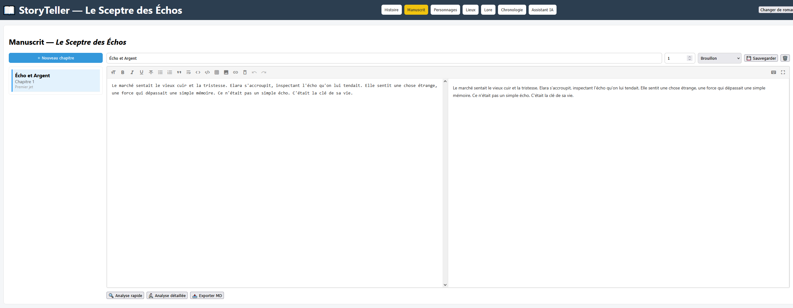
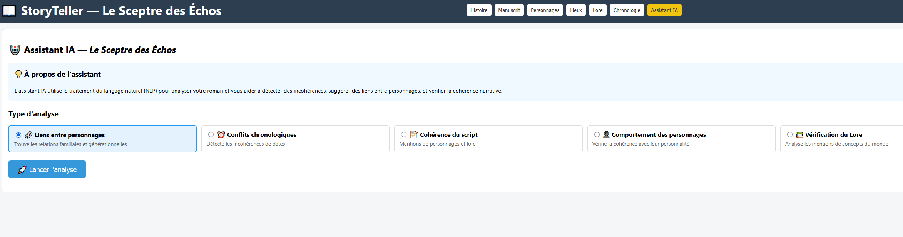

**StoryTeller - Installation et guide d'utilisation**
=====================================================

**1\. Installation du projet**
------------------------------

### **Prérequis**

*   Python 3.10+ ou 3.11
    
*   Node.js 18+ et npm
    
*   Git (optionnel)
    

### **Backend (FastAPI + SQLite)**

1.  Cloner le dépôt ou télécharger les fichiers.
    
2.  Créer un environnement virtuel et l'activer :
    

python -m venv .venvsource .venv/bin/activate  # Windows : .venv\\Scripts\\activate

1.  Installer les dépendances :
    

pip install -r requirements.txt

1.  Installer le modèle spaCy français (nécessaire pour l'Assistant IA) :
    

python -m spacy download fr\_core\_news\_md

1.  Initialiser la base de données :(La création des tables et le lancement des données de test sont désormais automatiques au démarrage du serveur si la DB est vide.)
    

\# Aucune commande 'flask db' n'est nécessaire avec la configuration actuelle de SQLAlchemy.# Les tables sont créées lors du premier lancement du serveur.

1.  **Lancer le serveur backend :**

python run.py

Le backend sera accessible sur http://127.0.0.1:5000/.

### **Frontend (React + Vite)**

1.  Se placer dans le dossier frontend/ :
    

cd frontend

1.  Installer les dépendances :
    

npm install

1.  Lancer l'application React :
    

npm run dev

1.  Ouvrir le navigateur sur l'URL affichée par Vite (ex: http://localhost:5173/).
    

**2\. Utilisation**
-------------------

### **2.1 Navigation**

La barre de navigation permet de basculer entre les panneaux du roman sélectionné :

*   **Histoire** : Synopsis, Quatrième de couverture.
    
*   **Manuscrit** : Édition des chapitres.
    
*   **Personnages** : Fiches détaillées.
    
*   **Lieux** : Lieux clés de l'histoire.
    
*   **Lore** : Entrées encyclopédiques (factions, magie, objets).
    
*   **Chronologie** : Événements ordonnés.
    
*   **Assistant IA** : Outils d'aide à la cohérence.
    

### **2.2 Gestion des Fiches (Personnages, Lieux, Lore)**

*   **Ajouter / Éditer :** Remplir les champs du formulaire et cliquer sur Enregistrer ou Mettre à jour.
    
*   **Sélection :** Cliquer sur un élément de la liste pour charger son formulaire d'édition.
    
*   **Supprimer :** Cliquer sur Supprimer sur l'élément souhaité.
    

### **2.3 Chronologie**

*   Ajouter un événement et l'associer à une date et à des personnages/lieux.
    
*   La liste s'affiche de manière ordonnée.
    

### **2.4 Histoire / Manuscrit**

*   Le panneau **Histoire** permet de modifier le titre, le synopsis et le blurb du roman.
    
*   Le panneau **Manuscrit** fournit un éditeur Markdown enrichi pour les chapitres.
    
*   **Sauvegarde :** Automatique toutes les 10 secondes (ou via bouton Sauvegarder).
    
*   **Export :** Export Markdown ou PDF via les boutons dans le panneau Histoire.
    

### **2.5 Assistant IA**

*   **Trouver liens personnages :** Suggère des relations basées sur les données.
    
*   **Vérifier chronologie :** Détecte les incohérences temporelles (âge, dates de naissance vs événements).
    
*   Le panneau **Manuscrit** utilise également l'IA pour l'analyse rapide ou détaillée du texte.
    

**3\. Copies d'écran (exemple)**
--------------------------------

### **Navigation principale**

### **Liste des Personnages**

### **Édition d'un chapitre manuscrit**

### **Assistant IA**

