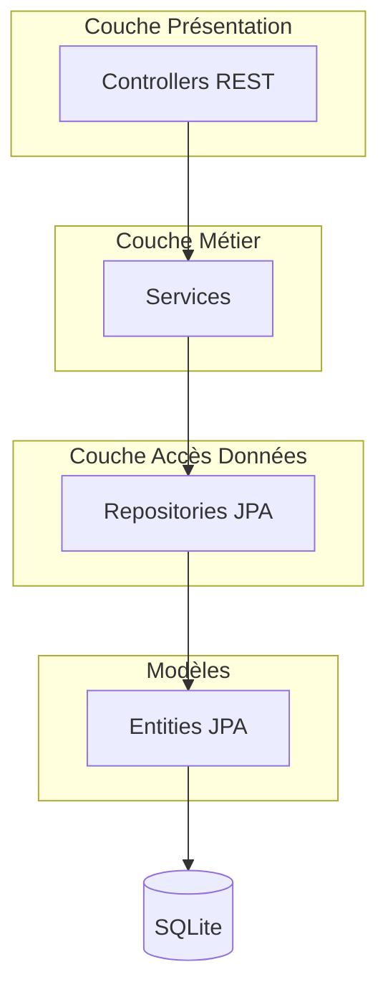
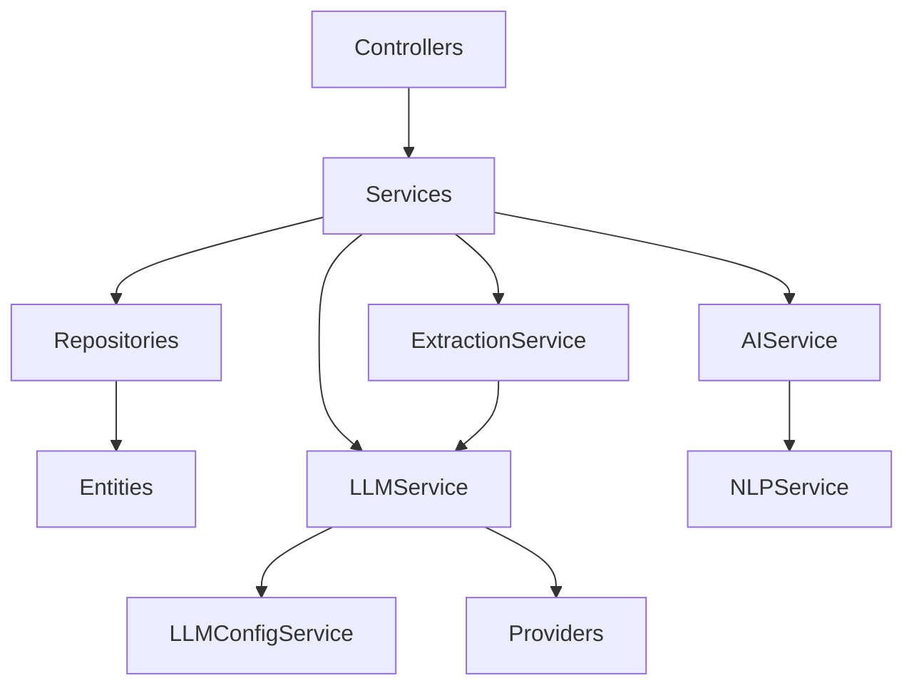
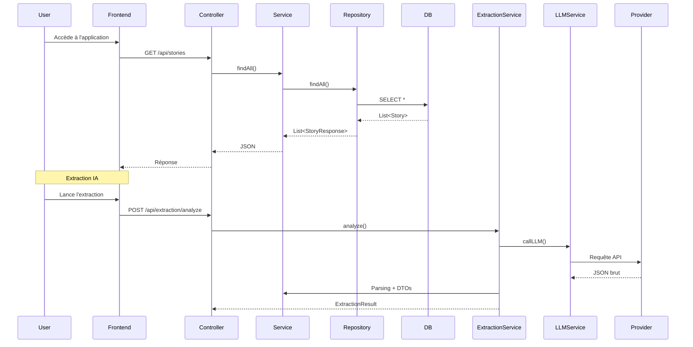

# StoryTeller Backend – Java 25 + Spring Boot 4.0.1

**Version** : 2.0.0  
**Stack** : Java 25 • Spring Boot 4.0.1 • Maven • SQLite • OpenNLP • Virtual Threads

Outil complet de gestion et d'écriture de romans avec assistance IA (LLM + Extraction automatique).

---

## Table des matières

1. [Architecture Globale](#architecture-globale)
2. [Technologies](#technologies)
3. [Structure du Projet](#structure-du-projet)
4. [Diagramme d'Interaction des Classes](#diagramme-dinteraction-des-classes)
5. [User Journey (Sequence Diagram)](#user-journey)
6. [Explication Détaillée des Classes](#explication-détaillée-des-classes)
7. [Configuration Spring Boot](#configuration-spring-boot)
8. [Fonctionnement du LLM](#fonctionnement-du-llm)
9. [NLP & Extraction](#nlp--extraction)
10. [Lancement du Projet](#lancement-du-projet)

---

## Architecture Globale



**Style architectural** : Clean Architecture + Layered Architecture avec séparation stricte des préoccupations.

---

## Technologies

| Couche              | Technologie                          | Version  | Rôle |
|---------------------|--------------------------------------|----------|------|
| Langage             | Java                                 | 25       | - |
| Framework           | Spring Boot                          | 4.0.1    | IOC, Web, JPA |
| ORM                 | Hibernate + Spring Data JPA          | 7.x      | Persistance |
| Base de données     | SQLite                               | -        | Embedded |
| NLP                 | Apache OpenNLP                       | 2.4.0    | Analyse texte |
| LLM                 | Anthropic / OpenAI / OpenRouter / Ollama | -        | Génération IA |
| Validation          | Jakarta Bean Validation              | -        | DTOs |
| Threads             | Virtual Threads                      | Java 21+ | Concurrence |

---

## Structure du Projet

```
src/main/java/com/kether/storyteller/
├── StoryTellerApplication.java          ← Point d'entrée
├── config/                              ← Configuration Spring
├── controller/                          ← Contrôleurs REST
├── dto/                                 ← Requests & Responses
├── entity/                              ← Entités JPA
├── exception/                           ← Gestion globale des erreurs
├── repository/                          ← Repositories JPA
├── service/                             ← Services métier
│   └── llm/                             ← Services LLM
└── config/                              ← Properties & Beans
```

---

## Diagramme d'Interaction des Classes



---

## User Journey (Sequence Diagram)



---

## Explication Détaillée des Classes

### 1. `StoryTellerApplication.java`

Point d’entrée de l’application. Active :
- `@SpringBootApplication`
- `@EnableJpaRepositories`
- `@EntityScan`
- `@EnableAsync` (Virtual Threads)
- `@EnableConfigurationProperties`

### 2. Configuration

- **`LLMProperties.java`** : `@ConfigurationProperties(prefix = "storyteller.llm")`
- **`WebConfig.java`** : CORS global
- **`GlobalExceptionHandler.java`** : Gestion centralisée des exceptions (`@RestControllerAdvice`)

### 3. Entités JPA

Toutes les entités utilisent Lombok + annotations standards JPA.

Exemples importants :
- **`StoryCharacter`** : Relation Many-to-Many avec `TimelineEvent`
- **`TimelineEvent`** : `@JoinTable` pour la table de jointure `timeline_character`

### 4. Repositories

Héritent de `JpaRepository`. Utilisent :
- Méthodes dérivées Spring Data
- `@Query` JPQL quand nécessaire

### 5. Services

- `@Service`
- `@Transactional`
- Injection par constructeur
- **LLMService** : Orchestrateur principal des providers LLM
- **ExtractionService** : Analyse + parsing LLM → DTOs
- **AIService** : Analyses avancées (cohérence, conflits, etc.)

### 6. Contrôleurs

- `@RestController`
- `@RequestMapping`
- Validation avec `@Valid`
- Retour de `ProblemDetail` en cas d’erreur

### 7. DTOs

Utilisation massive de **Java Records** (immuables, sérialisasses automatiquement).

---

## Configuration Spring Boot (`application.yml`)

Points clés :

```yaml
spring:
  datasource:
    url: jdbc:sqlite:./storyteller.db
  jpa:
    hibernate.ddl-auto: update
  threads.virtual.enabled: true
storyteller:
  llm:
    default-provider: anthropic
    config-file: llm_config.json
```

---

## Fonctionnement du LLM

1. `LLMConfigService` gère `llm_config.json`
2. `LLMController` expose `/config`, `/test`, `/health`
3. `LLMService` choisit le bon provider via `resolveProvider()`
4. Chaque provider implémente l’interface `LLMProvider`

---

## NLP & Extraction

- **`NLPService`** : OpenNLP (phrases, tokens, NER)
- **`ExtractionService`** : Envoie un prompt structuré au LLM et parse la réponse JSON
- **`AIService`** : Analyses sémantiques (cohérence personnages, timeline, lore, etc.)

---

## Lancement du Projet

```bash
# Développement
./mvnw spring-boot:run

# Production
./mvnw package
java -jar target/storyteller-api-2.0.0.jar
```

**Port par défaut** : 8000

---

